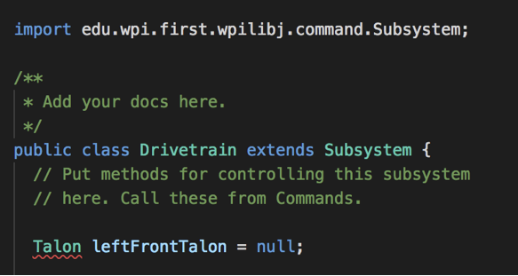
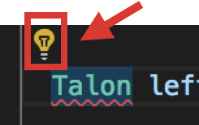
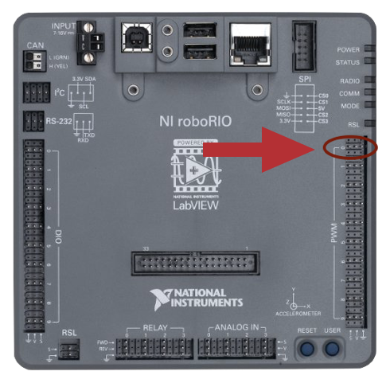

# **WIP** Creating a Basic Driving Robot

Lets get moving


> [Picture source: Team 2984](http://ljrobotics.org/games/power-up-2018/){target=_blank}

## Overview

In this section we will be going over:

1. Creating the basic Drivetrain subsystem
2. Adding subsystems to Robot.java, the main file that the robot runs and all other files must be in some way connected to.
3. Creating joysticks and using their axes to control the robot.
4. Creating and using DifferentialDrive and ArcadeDrive to make controlling the robot’s motors an easy process.
5. Deploying code to the roboRIO

***

## Creating the Drivetrain Subsystem

Before we begin we must create the class file for the drivetrain subsystem. See [Creating a New Subsystem](new_project.md#creating-a-new-subsystem){target=_blank} for info on how to do this.

### What will be added to the Drivetrain

In the Drivetrain class we will tell the subsystem what type of components it will be using.

- A Drivetrain needs motor controllers. In our case we will use 4 Talon SRs (a brand of controller for motors).
    - You could use other motor controllers such as Victor SPs or Talon SRXs but we will be using Talon SRs
      - If you are, replace Talon with TalonSRX, Victor, or VictorSP in the code you write depending on the type you use.
    - You can use 2 motors (left and right), but for this tutorial we will use 4.

!!! Tip
		Be sure to read [Visual Studio Code Tips](../basics/vscode_tips.md){target=_blank} before getting started! It will make your life a lot easier.

### Creating the Talon Variables

!!! summary ""
    **1)** Create 4 global variables of data type **Talon** and name them: `leftFrontTalon`, `rightFrontTalon`, `leftBackTalon`, `rightBackTalon`
   
    - To get started type the word Talon followed by the name i.e. `#!java Talon leftFrontTalon;`
    - These will eventually hold the object values for Talons and their port numbers.

!!! summary ""
    **2)** Next assign their values to `#!java null` ([more info on `null`](../basics/java_basics.md#overview){target=_blank}).
   
    - We do this to make sure it is empty at this point. 
    - When we assign these variables a value, we will be getting the motor controller's port numbers out of RobotMap
        - This means we cannot assign them at the global level

??? Example

	The code you typed should be this:

    ```java
    Talon leftFrontTalon = null;
    Talon leftBackTalon = null;
    Talon rightFrontTalon = null;
    Talon rightBackTalon = null;
    ```

	Your full **Drivetrain.java** should look like this:

    ```java
    package frc.robot.subsystems;

    import edu.wpi.first.wpilibj.Talon;
    import edu.wpi.first.wpilibj.command.Subsystem;

    /**
     * Add your docs here.
     */
    public class Drivetrain extends Subsystem {
      // Put methods for controlling this subsystem
      // here. Call these from Commands.

      Talon leftFrontTalon = null;
      Talon leftBackTalon = null;
      Talon rightFrontTalon = null;
      Talon rightBackTalon = null;

      @Override
      public void initDefaultCommand() {
        // Set the default command for a subsystem here.
        // setDefaultCommand(new MySpecialCommand());
      }
    }
	```

??? Warning "If an error occurs (red squiggles)"
	1. Click the word Talon
	
	2. 💡 Click the light bulb 
	
	3. Select "Import 'Talon' (edu.wpi.first.wpilibj)"
	
	4. Your error should be gone!

### Creating and filling the constructor

!!! summary ""
    **1)** Create the constructor for Drivetrain.java ([more info on constructors](../basics/java_basics.md#constructors){target=_blank})
   
    - The constructor is where we will assign values to our talon variables.

!!! summary ""
	Now that we have created the Talons we must initialize them and tell them what port on the roboRIO they are on.

    **2)** Initialize (set value of) `leftFrontTalon` to `#!java new Talon(0)`. 
      
	- This initializes a new talon, `leftFrontTalon`, in a new piece of memory and states it is on port 0 of the roboRIO. 
	- This should be done within the constructor `#!java Drivetrain()`
	- This calls the constructor `#!java Talon(int)` in the Talon class. 
    	- The constructor `#!java Talon(int)` takes a variable of type `#!java int`. In this case the `#!java int` (integer) refers to the port number on the roboRIO. 
  		
		??? Info "roboRIO port diagram"
    		  

??? Example

	The code you typed should be this:

    ```java
    public Drivetrain() {
      // Talons
      leftFrontTalon = new Talon(0);
    }
    ```

	Your full **Drivetrain.java** should look like this:

    ```java
    package frc.robot.subsystems;

    import edu.wpi.first.wpilibj.Talon;
    import edu.wpi.first.wpilibj.command.Subsystem;

    /**
     * Add your docs here.
     */
    public class Drivetrain extends Subsystem {
      // Put methods for controlling this subsystem
      // here. Call these from Commands.

      Talon leftFrontTalon = null;
      Talon leftBackTalon = null;
      Talon rightFrontTalon = null;
      Talon rightBackTalon = null;

	  public Drivetrain() {
        // Talons
        leftFrontTalon = new Talon(0);
      }

      @Override
      public void initDefaultCommand() {
        // Set the default command for a subsystem here.
        // setDefaultCommand(new MySpecialCommand());
      }
    }
	```

### Using RobotMap

Since each subsystem has its own components with their own ports, it is easy to lose track of which ports are being used and for what. To counter this you can use a class called **RobotMap** to hold all these values in a single location.

!!! summary ""
    **1)** To use RobotMap, instead of putting `0` for the port on the Talon type: `#!java RobotMap.DRIVETRAIN_LEFT_FRONT_TALON`.
   
    - Names should follow the pattern SUBSYSTEM_NAME_OF_COMPONENT
    - The name is all caps since it is a **constant** ([more info on constants](../basics/java_basics.md#constants){target=_blank}).

!!! summary ""
    **2)** Click on the underlined text 
	
	**3)** Click on the 💡light bulb and select “create constant…”
	
	**4)** Click on RobotMap.java tab that just popped up
	
	**5)** Change the `0` to the correct port for that motor controller on your robot/roboRIO
	
	
	!!! Danger
		***If you set this to the wrong value, you could damage your robot when it tries to move!***
   
	**6)** Repeat these steps for the remaining Talons.

	!!! Tip
    	Remember to save both **Drivetrain.java** and **RobotMap.java**

??? Example

	The code you type should be this:

    ```java
    leftFrontTalon = new Talon(RobotMap.DRIVETRAIN_LEFT_FRONT_TALON);
    ```

	Your full **Drivetrain.java** should look like this:

    ```java
    package frc.robot.subsystems;

    import edu.wpi.first.wpilibj.Talon;
    import edu.wpi.first.wpilibj.command.Subsystem;
    import frc.robot.RobotMap;

    /**
     * Add your docs here.
     */
    public class Drivetrain extends Subsystem {
      // Put methods for controlling this subsystem
      // here. Call these from Commands.

      Talon leftFrontTalon = null;
      Talon leftBackTalon = null;
      Talon rightFrontTalon = null;
      Talon rightBackTalon = null;

      public Drivetrain() {
        // Talons
        leftFrontTalon = new Talon(RobotMap.DRIVETRAIN_LEFT_FRONT_TALON);
        leftBackTalon = new Talon(RobotMap.DRIVETRAIN_LEFT_BACK_TALON);
        rightFrontTalon = new Talon(RobotMap.DRIVETRAIN_RIGHT_FRONT_TALON);
        rightBackTalon = new Talon(RobotMap.DRIVETRAIN_RIGHT_BACK_TALON);
      }

      @Override
      public void initDefaultCommand() {
        // Set the default command for a subsystem here.
        // setDefaultCommand(new MySpecialCommand());
      }
    }
	```

	Your full **RobotMap.java** should look similar to this:	

    ```java
    package frc.robot;

    public class RobotMap {
	  // Talons
      public static final int DRIVETRAIN_LEFT_FRONT_TALON = 0;
      public static final int DRIVETRAIN_LEFT_BACK_TALON = 1;
      public static final int DRIVETRAIN_RIGHT_FRONT_TALON = 2;
      public static final int DRIVETRAIN_RIGHT_BACK_TALON = 3;
    }
	```

	!!! Warning
      	Remember to use the values for **YOUR** specific robot or you could risk damaging it!

<!-- TODO: maybe add lets code along -->