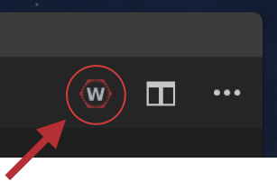
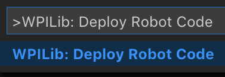

# Deploying Robot Code

Bring your creation to life!

## Overview

This section will help you learn to deploy code to your robot.

**See table of contents for a breakdown of this section.**

***

## How to deploy

### Hardware

To deploy code, first make sure your computer is  connected to the robot in **ONE** of the following ways:

- **USB**
- **Ethernet**
- **Robot's Wireless Network**

### Software

!!! Note
		Make sure your team number in **wpilib_preferences.json** in the **.wpilib** folder is set to the same team number your roboRIO was programmed for (it should be the number you set when creating the project and you will NOT need to check this every time as it should not change by itself).

!!! summary ""
    **1)** Select the **W icon** from the tab bar or use the shortcut by holding down **Ctrl+Shift+P** at the same time. (Replace ctrl with cmd on macOS)

	

!!! summary ""
    **2)** Type and hit enter or select: WPILib: Deploy Robot Code

	

!!! Tip
		Alternatively you can do one of the following:

		- Use **Shift+F5** at any time to deploy. (you may also need to hold fn depending on your computer configuration)
		- Right-click on the build.gradle file in the project hierarchy and select "Build Robot Code”
		- Open the shortcut menu indicated by the ellipses in the top right corner of the VS Code window and select "Build Robot Code"

***

## Testing

1. Open up the DriverStation software on any computer that has it installed.
2. Enable the robot
3. Try moving the joysticks on your controller when enabled.
      1. If it doesn’t, check your port numbers for your controller, axes, and motor controllers

<!-- TODO: make note about reading error log. resource allocation and robots don't quit -->