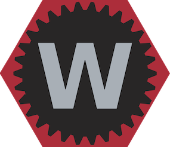
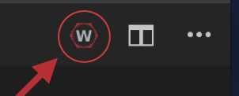
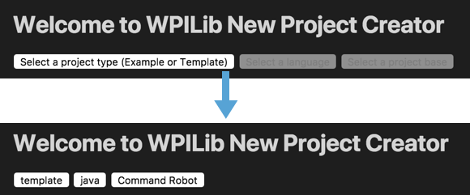
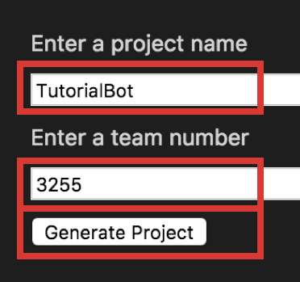
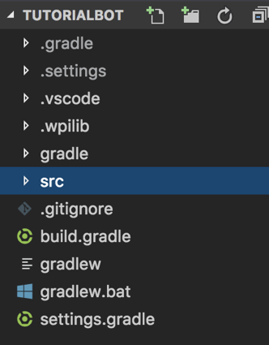
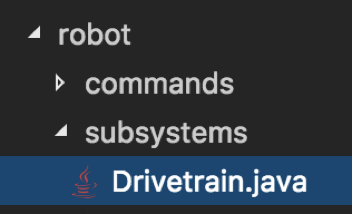
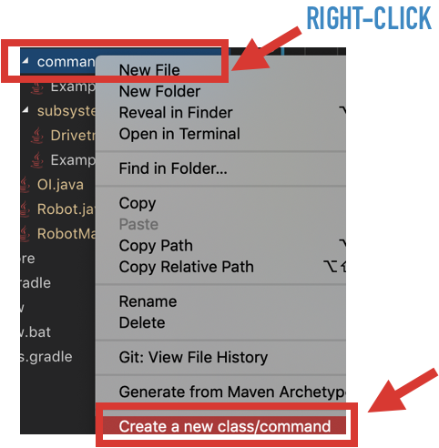

# Creating Project Files

Lets get started

{: style="height:150px"}
{: style="height:150px"}

## Overview

Before we can start programing a robot, we must create a new project in Visual Studio Code (VSCode). 

**See table of contents for a breakdown of this section.**

***

## Creating a New Project

!!! summary ""
	**1)** Select the **W icon** from the tab bar or use the shortcut by holding down **Ctrl+Shift+P** at the same time. (Replace ctrl with command on macOS)  
	
	

!!! summary ""
	**2)** Type and hit enter or select **WPILib: Create a new project**
	
	

!!! summary ""
	**3)** Click **Select a Project Type** and choose **Template**  
	**4)** Click **Select a Language** and choose **Java**  
	**5)** Click **Select a project base** and choose **Command Robot**  
	
	

!!! summary ""
	**6)** Click **Select a new project folder** and choose where on your computer you would like to store the program
	
	

!!! summary ""
	**7)** **Enter a project name** in the text field labeled as such  
	**8)** **Enter your team number** in the text field labeled as such  
	**9)** Select **Generate Project**  
	
	

!!! summary ""
	**10)**  When prompted **“Would you like to open the folder?”**, select **Yes (Current Window)**
	
	

### Default Project Contents

Newly created projects have many files within them. We only care about the contents within the **src/main/java/frc/robot/** folder. Everything else can be ignored at this point in the tutorial.

**Files in the robot folder:**

- **ExampleCommand.java**
    - An example Command
- **ExampleSubsystem.java**
    - An example SubSystem
- **Constants.java** (new in 2020, replaces RobotMap.java)
    - Used to map physical ports (digital if using the CAN bus) of sensors or devices connected to the robot and assign them a variable name to be used in other parts of the code.
        - This provides flexibility for changing wiring, makes checking the wiring easier, and significantly reduces the number of magic numbers floating around.
    - Can also be used to store generic constant values as variables in the code
- **Main.java**
    - Used for advanced programming 
    - Will be ignored/left as is for this tutorial
- **RobotContainer.java** (new in 2020, replaces OI.java)
    - Used to declare our subsystem
    - Used to create a connection between commands and Operator Interfaces (OI) such as Joysticks or buttons
- **Robot.java**
    - The main class of the robot which is run when a robot boots up.
    - Used to run special methods in the init and period phases of the auto, teleop, and disabled states

??? Example 
    

***

## Creating a New Subsystem

!!! summary ""
	**1)** Click on the **src** folder to expand it.  
	**2)** Do the same for **java** then **subsystems**
	
	

!!! summary ""
	**3)** Right click on **subsystems** and select **Create a new class/ command.**
	
	
	
!!! summary ""
	**4)** Select **Subsystem (New)** and type your **DesiredSubsystemName** (i.e. **Drivetrain**) for the name and hit enter on your keyboard.
	
	  
	

!!! summary ""
	**5)** Click on the newly created **DesiredSubsystemName.java** (or **Drivetrain.java** if you named it that)
	
	

### Adding the Subsystem to RobotContainer.java

<!-- TODO: Make import note -->
!!! warning "Do not forget this step!"
	When a robot program runs on the roboRIO it only runs the main file Robot.java and anything Robot.java links to such as RobotContainer.java.  
	We have created a new subsystem but we have not yet linked it to Robot.java through RobotContainer.java.  

	!!! danger "***We must do this for EVERY subsystem we create***"

!!! summary ""
	**1)** In RobotContainer.java we will create a new **public** **global** **constant** variable of type `DesiredSubsystemName` (i.e. `Drivetrain`):  
    `#!java public static final m_desiredSubsystemName = new DesiredSubsystemName();`  
    (i.e. `#!java public static final m_drivetrain = new Drivetrain();`)

	

Now when we use this subsystem in commands, we must call `#!java RobotContainer.m_desiredSubsystemName.` to get access to it and its methods. (i.e. `#!java RobotContainer.m_drivetrain.someMethod()`)

### Default Subsystem Contents

Newly created subsystems are empty with the exception of the periodic.

- Currently there is no constructor, we will create a constructor ourselves later.
- **periodic** - a method that will be called periodically (once per robot scheduler run)
    - Useful for adding/updating data to Driverstation dashboard
    - Useful updating variables that need to always up to date

??? Example  
    ```java
    package frc.robot.subsystems;

    import edu.wpi.first.wpilibj2.command.SubsystemBase;

    public class Drivetrain extends SubsystemBase {
      /**
       * Creates a new Drivetrain.
       */
      public Drivetrain() {

      }

      @Override
      public void periodic() {
        // This method will be called once per scheduler run
      }
    }
	```

***

## Creating a New Command

!!! summary ""
	**1)** Click on the **src** folder to expand it (if it isn't already).  
	**2)** Do the same for **commands**
	
	

!!! summary ""
    **3)** Right click on **commands** and select **Create a new class/ command.**  
	
	

!!! summary ""
	**4)** Select **Command (New)** and type **DesiredCommandName** (i.e. DriveArcade) for the name and hit enter on your keyboard.  
	
	  
	

!!! summary ""
    **5)** Click on the newly created **DesiredCommandName.java** (or **DriveArcade.java** if you named it that)
	
	

### Default Command Contents

Newly created commands have some predefined methods in them specific for a command based robot.

- **Constructor** - Called when the robot program is ___FIRST___ loaded.
    - Subsystem dependencies are declared here.
- **initialize()** - Called ___ONCE___ just before this Command runs the first time.
- **execute()** - Called ___REPEATEDLY___ when this Command is scheduled to run
- **end()** - Called ___ONCE___ after isFinished returns true or when ___another command___ which requires one or more of the same subsystems is scheduled to run
- **isFinished()** - Make this return ___TRUE___ when this Command no longer needs to run `execute()` (initialize always runs once regardless). 

??? Example
    ```java
  	package frc.robot.commands;

    import edu.wpi.first.wpilibj2.command.CommandBase;

    public class DriveArcade extends CommandBase {
      /**
       * Creates a new DriveArcade.
       */
      public DriveArcade() {
        // Use addRequirements() here to declare subsystem dependencies.
      }

      // Called when the command is initially scheduled.
      @Override
      public void initialize() {
      }

      // Called every time the scheduler runs while the command is scheduled.
      @Override
      public void execute() {
      }

      // Called once the command ends or is interrupted.
      @Override
      public void end(boolean interrupted) {
      }

      // Returns true when the command should end.
      @Override
      public boolean isFinished() {
        return false;
      }
    }
	```
